# Code of ŚMIGIEL

## Overview

This repository shows the steps involved in creation of [ŚMIGIEL Dataset](HF), used in [PolEval 2025 Task 1: Spotting Machine-Generated Text from LLMs for Polish](https://github.com/poleval/2025-smigiel). Here's the [original ŚMIGIEL paper](https://lrec.elra.info/lrec2026-main-828). 👨🏼‍🔬

Specifically, the code of this repo can

- acquire source datasets of texts from various domains in Polish
- process text, inc. cleaning, filtration, selection and prefix extraction
- prepare domain-specific prompts
- setup execution environment in a cluster for Multi-GPU processing
- manage LLMs, inc. inference using various decoding strategies
- group, balance and sample the data
- perform customizable cleaning on the generated data

## Quickstart

The project uses [uv](https://docs.astral.sh/uv/). Upon install, run the following in the root directory to install the dependencies:

```shell
uv sync
```

To run the CLI, use

```shell
uv run cli.py [command] [...options]
```

```shell
uv run cli.py preprocess --datasets wiki
```

## Commands

The available commands map directly to the pipeline stages shown in [The procedure](#the-procedure). They are intended to be run roughly in this order:

| Stage | Command            | What it does                                                                                                  | Key options                                                     |
| ----- | ------------------ | ------------------------------------------------------------------------------------------------------------- | --------------------------------------------------------------- |
| 0     | `test`             | Lists all known source datasets — useful as a sanity check that every loader is wired up.                     | —                                                               |
| 1a    | `extract`          | Per dataset: downloads the raw source (if not cached) and extracts text prefixes via the LAMBO segmenter.     | `--datasets`                                                    |
| 1b    | `prompt`           | Per dataset: builds Polish-language LLM prompts from the extracted prefixes.                                  | `--datasets`                                                    |
| 1     | `preprocess`       | Convenience: runs `extract` and `prompt` in one go.                                                           | `--datasets`                                                    |
| 2     | `assemble-domains` | Aggregates per-dataset preprocessed data into per-domain pools and samples them down.                         | `--domains`, `--cap`                                            |
| 3     | `compose-input`    | Composes the final `generation_input.csv` — the single CSV consumed by the cluster inference jobs.            | `--domains`, `--output_file`                                    |
| 4     | `generate`         | Dispatches Slurm jobs for LLM inference on the cluster. Generates one batch per `(model, slice)` combination. | `--input_file`, `--models`, `--batched`, `--walltime`, `--name` |
| 5     | `forge-tests`      | After postprocessing, composes the final `test_A` and `test_B` from `alpha`, `beta`, and `gamma` subsets.     |

Postprocessing (cleaning the cluster outputs into `train`, `alpha`, `beta`, and `gamma` splits) is currently driven by `postprocessing/postprocess.py` directly rather than through the CLI.

### Example: full local preprocessing run

```shell
uv run cli.py test                                           # 0  verify
uv run cli.py preprocess --datasets wiki plsc twitter        # 1  extract + prompt per dataset
uv run cli.py assemble-domains --domains lit reviews         # 2  build domain pools
uv run cli.py compose-input --domains lit reviews \
                            --output_file generation_input.csv   # 3  compose CSV
```

## Architecture

The code can be broken two main parts, both available through the CLI:

1. comprehensive pipelines run with `[COMMAND]` argument. Covers from data retrieval to postprocessing and final composition, along with utilities for balancing the domains, filtering the content and composing the resulting dataset. Intended to be run locally.
2. the inference script, focusing on cluster configuration, LLM management and generation. It is driven by dynamically composed Slurm configuration file and is intended for the cluster.

## The procedure

ŚMIGIEL data is built upon 12 datasets of human-written texts in Polish. Each of them is processed in a roughly the same way:



## The dataset

### Source Data

The original, human-written texts are coming from 12 distinct datasources. Collectively, they cover wide range of styles, lengths, and purposes of text-writing.

| Internal name     | Domain     | Description                                                 | Source                                                                                                 |
| ----------------- | ---------- | ----------------------------------------------------------- | ------------------------------------------------------------------------------------------------------ |
| `wiki`            | wiki       | Polish Wikipedia                                            | [chrisociepa/wikipedia-pl-20230401](https://huggingface.co/datasets/chrisociepa/wikipedia-pl-20230401) |
| `plsc`            | literature | Polish scientific article abstracts                         | [rafalposwiata/plsc](https://huggingface.co/datasets/rafalposwiata/plsc)                               |
| `coursebooks`     | literature | Polish open coursebooks                                     | [rafalposwiata/open-coursebooks-pl](https://huggingface.co/datasets/rafalposwiata/open-coursebooks-pl) |
| `classics`        | literature | Polish classic literature corpus                            | [dmitriilebedev/polish-corpus](https://www.kaggle.com/datasets/dmitriilebedev/polish-corpus) (Kaggle)  |
| `twitter`         | social     | Polish tweets (TwitterEmo)                                  | [clarin-pl/twitteremo](https://huggingface.co/datasets/clarin-pl/twitteremo)                           |
| `wykop`           | social     | Polish social media posts (BAN-PL, non-offensive only)      | [ZILiAT-NASK/BAN-PL](https://github.com/ZILiAT-NASK/BAN-PL)                                            |
| `polemo_hotels`   | reviews    | Hotel reviews (PolEmo 2.0)                                  | [clarin-pl/polemo2-official](https://huggingface.co/datasets/clarin-pl/polemo2-official)               |
| `polemo_medicine` | reviews    | Medical reviews (PolEmo 2.0)                                | [clarin-pl/polemo2-official](https://huggingface.co/datasets/clarin-pl/polemo2-official)               |
| `polemo_products` | reviews    | Product reviews (PolEmo 2.0)                                | [clarin-pl/polemo2-official](https://huggingface.co/datasets/clarin-pl/polemo2-official)               |
| `polemo_courses`  | reviews    | Course reviews (PolEmo 2.0)                                 | [clarin-pl/polemo2-official](https://huggingface.co/datasets/clarin-pl/polemo2-official)               |
| `allegro`         | reviews    | Allegro marketplace reviews                                 | [PL-MTEB/allegro-reviews](https://huggingface.co/datasets/PL-MTEB/allegro-reviews)                     |
| `filmweb`         | reviews    | Polish movie reviews (FilmwebPlus)                          | [narolski/filmwebplus](https://github.com/narolski/filmwebplus)                                        |
| `pmrd`            | reviews    | Polish Movie Reviews Dataset                                | [kamilsan/polish-movie-reviews-dataset](https://github.com/kamilsan/polish-movie-reviews-dataset)      |
| `wikinews`        | news       | Polish Wikinews articles (custom scrape)                    | [pl.wikinews.org](https://pl.wikinews.org)                                                             |
| `gov`             | government | Polish parliamentary debates — Sejm + Senat (ParlaMint 5.0) | [ParlaMint-PL, CLARIN.SI](https://www.clarin.si/repository/xmlui/handle/11356/2004)                    |

### Domains

To help to balance the detaset in terms of linguistic features, the original sources were grouped into 6 genres or "domains". This balancing is two-fold - it's inward, as the origin of texts within a domain is balanced how much was possible, and outward, as the main part of the data, (`train` and `alpha` test subgroup) consists of equal share of the 4 domains. The two remaining ones, news articles and parlimentary hearings, were introduced as part of robust training subset.

### Models

To provide for versitile MGT, we used models coming from different families, and of varying sizes.

| Moniker      | Size   | Full name                  | HuggingFace                                                                                         |
| ------------ | ------ | -------------------------- | --------------------------------------------------------------------------------------------------- |
| `llama-sm`   | small  | Llama 3.1 8B Instruct      | [meta-llama/Llama-3.1-8B-Instruct](https://huggingface.co/meta-llama/Llama-3.1-8B-Instruct)         |
| `bielik-sm`  | small  | Bielik 7B Instruct v0.1    | [speakleash/Bielik-7B-Instruct-v0.1](https://huggingface.co/speakleash/Bielik-7B-Instruct-v0.1)     |
| `mistral-sm` | small  | Mistral 7B Instruct v0.3   | [mistralai/Mistral-7B-Instruct-v0.3](https://huggingface.co/mistralai/Mistral-7B-Instruct-v0.3)     |
| `bielik-md`  | medium | Bielik 11B v2.3 Instruct   | [speakleash/Bielik-11B-v2.3-Instruct](https://huggingface.co/speakleash/Bielik-11B-v2.3-Instruct)   |
| `mistral-md` | medium | Mistral Nemo Instruct 2407 | [mistralai/Mistral-Nemo-Instruct-2407](https://huggingface.co/mistralai/Mistral-Nemo-Instruct-2407) |
| `plum`       | medium | PLLuM 12B nc chat          | [CYFRAGOVPL/PLLuM-12B-nc-chat](https://huggingface.co/CYFRAGOVPL/PLLuM-12B-nc-chat)                 |
| `gemma`      | large  | Gemma 3 27B Instruct       | [google/gemma-3-27b-it](https://huggingface.co/google/gemma-3-27b-it)                               |
| `llama-lg`   | large  | Llama 3.3 70B Instruct     | [meta-llama/Llama-3.3-70B-Instruct](https://huggingface.co/meta-llama/Llama-3.3-70B-Instruct)       |

### Strategies

We foster versitality of (generated) data by applying different decoding strategies. These strategies condition how "next token candidates" or strings of thereof are ultimately selected by the model. Below we provide their rundown, together with how they translate into parametrs of model inference's call.

| Strategy              | Full name            | Parameters                                              | Reference                                                                                      |
| --------------------- | -------------------- | ------------------------------------------------------- | ---------------------------------------------------------------------------------------------- |
| `greedy`              | Greedy decoding      | `do_sample=False`                                       | [HF docs](https://huggingface.co/docs/transformers/generation_strategies#greedy-search)        |
| `sampling`            | Multinomial sampling | `do_sample=True, num_beams=1`                           | [HF docs](https://huggingface.co/docs/transformers/generation_strategies#multinomial-sampling) |
| `beam_search`         | Beam search          | `num_beams=2`                                           | [HF docs](https://huggingface.co/docs/transformers/generation_strategies#beam-search-decoding) |
| `contrastive`         | Contrastive search   | `penalty_alpha=0.6, top_k=4`                            | [Su et al., 2022](https://arxiv.org/abs/2202.06417)                                            |
| `dbs`                 | Diverse beam search  | `num_beams=6, num_beam_groups=3, diversity_penalty=1.0` | [Vijayakumar et al., 2018](https://arxiv.org/abs/1610.02424)                                   |
| `llama_plum_sampling` | Temperature sampling | `do_sample=True, temperature=0.6, top_p=0.9`            | — (custom config for `llama-lg` and `plum`)                                                    |

### Composition

Test A and Test B are both composed out of thee distinct subsets of data - **alpha**, **beta**, and **gamma**. The two tests differ in proportions of sampled data.

| Subset    | Data             | Models                    | Examples | Share in `test_a` | Share in `test_b` |
| --------- | ---------------- | ------------------------- | -------: | :---------------: | :---------------: |
| **alpha** | old (4 domains)  | all 7 base models + human |    4 505 |         ½         |         ½         |
| **beta**  | old (4 domains)  | `llama-lg` only + human   |    4 356 |         ⅓         |         ⅔         |
| **gamma** | new (news + gov) | all 8 models + human      |   19 914 |         ⅓         |         ⅔         |

- **alpha** is simply the `test` split of the base postprocessing run
- **beta** is a result of processing human texts from the `dev` split with a single model (`llama-lg`, Llama 3.3 70B)
- **gamma** uses all the available models to process data from unseen datasets (the data was not published before)

The subsets contribute to the two resulting test groups through a round-robin assignment method. While the contribution of **alpha** is equal in both, the larger Test B gets more content from **beta** and **gamma**.

## About the Shared Task

[Śmigiel](https://github.com/poleval/2025-smigiel) is a Shared Task on Machine-Generated-Text (MGT) Detection, which for the first time took place as part of [PolEval 2025](http://poleval.pl/tasks/task1) competition organized by [The Linguistic Engineering (LE) Group](https://zil.ipipan.waw.pl/), part of the Department of Artificial Intelligence at the Institute of Computer Science, Polish Academy of Sciences (IPI PAN) <!-- TODO: add a sentence on the participants? -->

## Citation

```
@article{
  title={Śmigiel Dataset: Laying Foundations for Investigating Machine-Generated Text Detection in Polish},
  author={Jakub Strebeyko, Alina Wróblewska, Piotr Przybyła},
  journal={LREC 2025},
  year={2025},
  doi={10.63317/3p7ghe9pfm8v}
}
```
