# Code of ŚMIGIEL

## Overview

This repository shows the steps involved in creation of [ŚMIGIEL Dataset](HF), used in [PolEval 2025 Task 1: Spotting Machine-Generated Text from LLMs for Polish](https://github.com/poleval/2025-smigiel).

Specifically, the code of this repo can

- acquire source datasets of texts from various domains in Polish
- process text, inc. cleaning, filtration, selection and prefix extraction
- prepare domain-specific prompts
- setup execution environment in a cluster for Multi-GPU processing
- manage LLMs, inc. inference using various decoding strategies
- group, balance and sample the data
- perform customizable cleaning on the generated data

## Architecture

The code can be broken up into two main parts:

1. the CLI, offering the basic data transformation steps. It covers all the data preparation and postprocessing steps, along with utilities for balancing the domains, filtering the content and composing the resulting dataset. Intended to be run locally.
2. the inference script, focusing on cluster configuration, LLM management and generation. It is driven by dynamically composed Slurm configuration file and is intended for the cluster.

## Quickstart

The project uses [uv](https://docs.astral.sh/uv/). Upon install, run the following in the root directory to install the dependencies:

```shell
uv sync
```

To run the CLI, use

```shell
uv run cli.py [command] [...options]
```

```shell
uv run cli.py preprocess --datasets wiki
```

## About the Shared Task

[Śmigiel](https://github.com/poleval/2025-smigiel) is a Shared Task on Machine-Generated-Text (MGT) Detection, which for the first time took place as part of [PolEval 2025](http://poleval.pl/tasks/task1) competition organized by [The Linguistic Engineering (LE) Group](https://zil.ipipan.waw.pl/), part of the Department of Artificial Intelligence at the Institute of Computer Science, Polish Academy of Sciences (IPI PAN) <!-- TODO: add a sentence on the participants? -->

## The procedure

ŚMIGIEL data is built upon 12 datasets of human-written texts in Polish. Each of them is processed in a roughly the same way:

```mermaid
flowchart LR

    %% ── Source datasets grouped by domain ───────────────────────────────────
    subgraph SRC["Original Sources"]
        direction TB
        subgraph DW["Wikipedia"]
            wiki@{ shape: doc, label: "Polish Wikipedia\n286 513" }
        end
        subgraph DL["Literature"]
            plsc@{ shape: doc, label: "PLSC\n(scientific abstracts)\n12 000" }
            cb@{ shape: doc, label: "Open Coursebooks PL\n1 288" }
            cl@{ shape: doc, label: "Polish Classics Corpus\n27 287" }
        end
        subgraph DS["Social Media"]
            tw@{ shape: doc, label: "TwitterEmo\n17 648" }
            wk@{ shape: doc, label: "BAN-PL (Wykop)\n14 450" }
        end
        subgraph DR["Reviews"]
            ph@{ shape: doc, label: "PolEmo 2.0 — Hotels\n3 951" }
            pm@{ shape: doc, label: "PolEmo 2.0 — Medicine\n3 272" }
            pp@{ shape: doc, label: "PolEmo 2.0 — Products\n483" }
            pc@{ shape: doc, label: "PolEmo 2.0 — Courses\n475" }
            al@{ shape: doc, label: "Allegro Reviews\n10 715" }
            fw@{ shape: doc, label: "FilmwebPlus\n55 863" }
            pr@{ shape: doc, label: "Polish Movie Reviews\n(PMRD)\n12 009" }
        end
        subgraph DG["News & Government  (new data)"]
            wn@{ shape: doc, label: "Polish Wikinews\n44 366" }
            gv@{ shape: doc, label: "ParlaMint-PL 5.0\n(Sejm + Senat)\n67 628" }
        end
    end

    %% ── Domain-level aggregation & sampling ─────────────────────────────────
    %% Pool sizes reflect full preprocessed data; only 12 000 rows per domain
    %% are sampled into generation_input (wiki pool is 286 513, reviews 20 657)
    DW -->|"preprocess\n→ pool 286 513\n↓ sample 12 000"| dw_d["wiki\n12 000"]
    DL -->|"preprocess\n→ pool 12 000"| dl_d["lit\n12 000"]
    DS -->|"preprocess\n→ pool 12 000"| ds_d["social\n12 000"]
    DR -->|"preprocess\n→ pool 20 657\n↓ sample 12 000"| dr_d["reviews\n12 000"]
    DG -->|"preprocess\n→ pool 111 994"| dg_d["gamma\n111 994"]

    %% ── Generation inputs ────────────────────────────────────────────────────
    dw_d & dl_d & ds_d & dr_d --> GI[/"generation_input\n48 000 prompts\n12 000 × 4 domains"/]
    dg_d --> GIG[/"gamma_input\n111 994 prompts"/]

    %% ── Main generation pipeline ─────────────────────────────────────────────
    GI -->|"× 7 models\n× strategies"| PROD["prod\n336 000\n84 000 / domain"]
    PROD -->|"postprocessing\n& dedup"| BASE

    subgraph BASE["base  |  44 749"]
        tr["training\n35 763"]
        ts["test\n4 505"]
        dv["dev\n4 481"]
    end

    %% ── Gamma pipeline ───────────────────────────────────────────────────────
    GIG -->|"× 8 models\n× strategies"| GGEN["gamma prod"]
    GGEN -->|"postprocessing"| gamma_post(["gamma\n19 914"])

    %% ── Beta pipeline ────────────────────────────────────────────────────────
    dv -->|"llama-lg\n× strategies"| bgen["llama-lg output"]
    bgen -->|"postprocessing"| beta_post(["beta\n4 356"])

    %% ── Alpha ────────────────────────────────────────────────────────────────
    ts --> alpha(["alpha\n4 505"])

    %% ── Test assembly ────────────────────────────────────────────────────────
    alpha & beta_post & gamma_post -->|"½ · ⅓ · ⅓\ninterleaved"| TA(["test_A\n10 343"])
    alpha & beta_post & gamma_post -->|"½ · ⅔ · ⅔\ninterleaved"| TB(["test_B\n18 432"])

```



TBC
